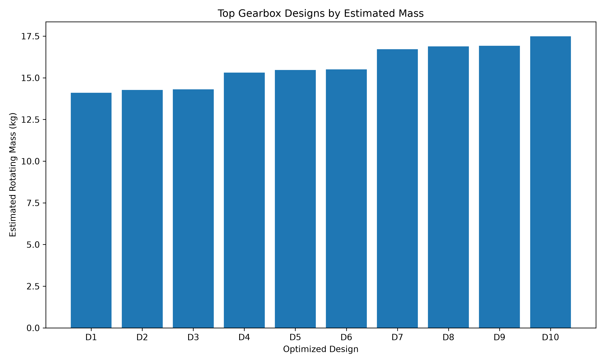
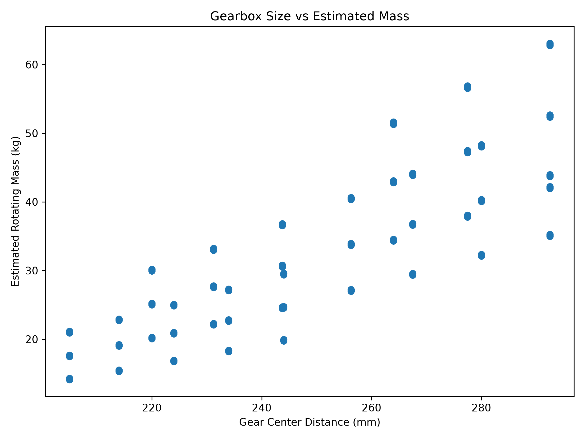
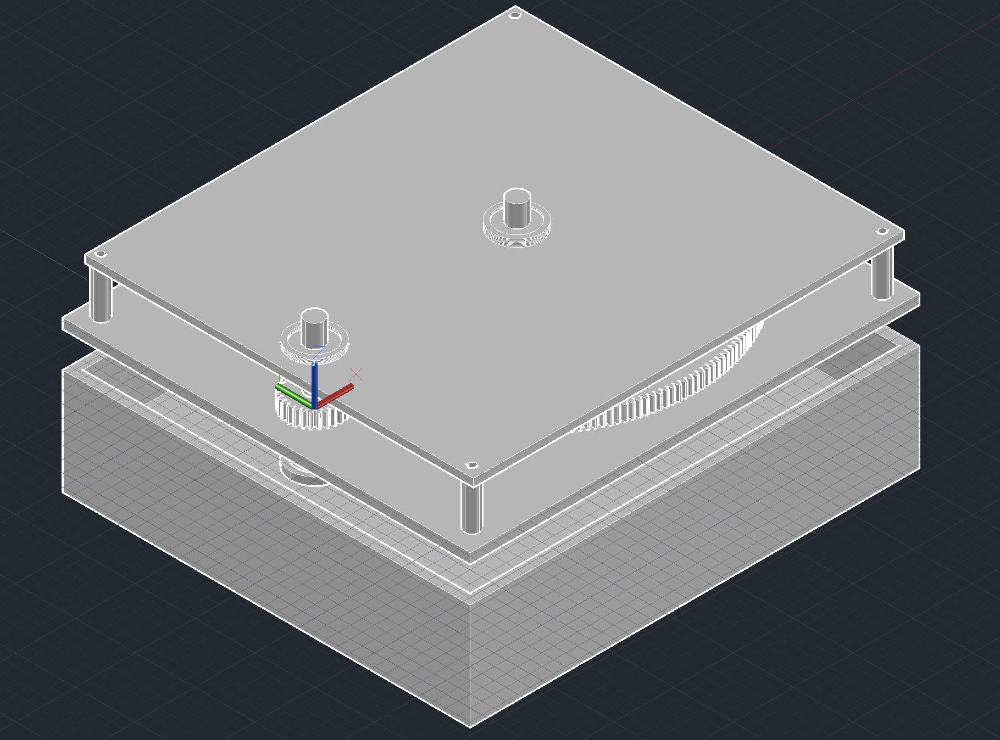
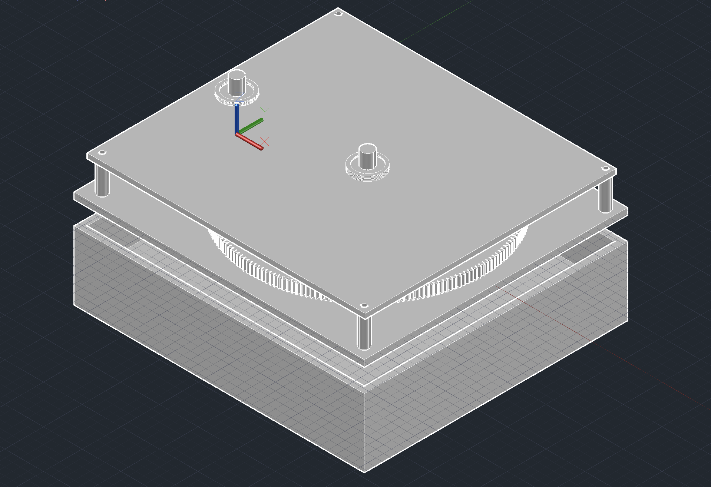
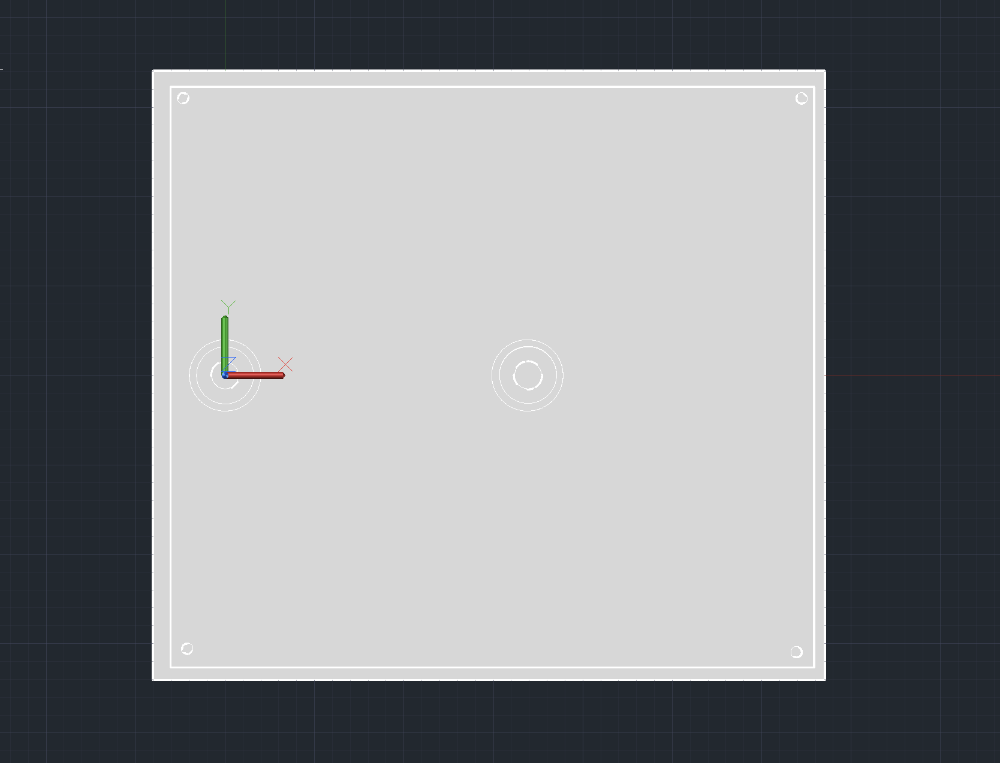
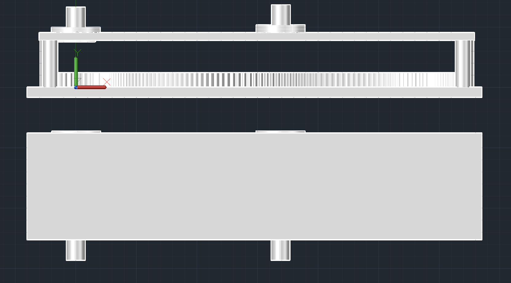
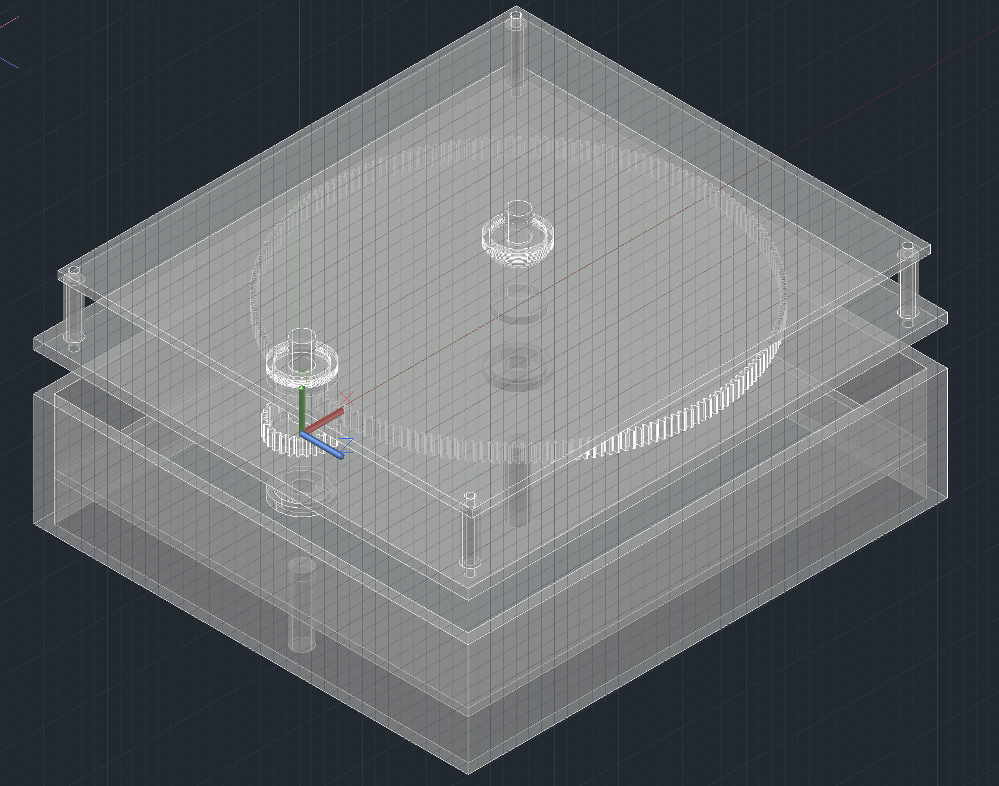
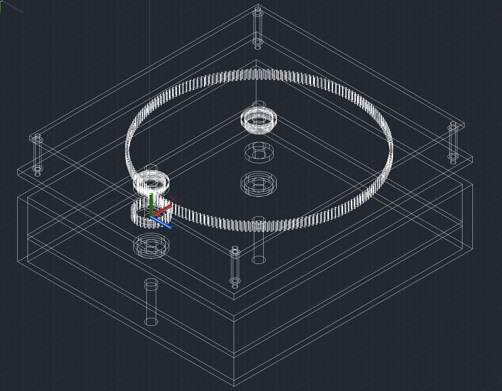

# ⚙️ GearOpt — Gearbox Design & Optimization Software

GearOpt is a Python-based mechanical engineering design tool that evaluates and optimizes single-stage spur gearbox configurations based on gear ratio, strength, shaft sizing, bearing life, packaging constraints, and estimated mass.

The project combines analytical machine-design calculations, automated design-space exploration, engineering optimization, and 3D CAD validation.

---

## Project Objective

The goal of GearOpt is to automate the preliminary design of a spur gearbox for a specified power, input speed, and desired output speed.

For the example design case:

- **Input Power:** 5 kW
- **Input Speed:** 3500 RPM
- **Target Output Speed:** 500 RPM
- **Required Reduction Ratio:** 7:1

The program generates candidate gearbox configurations, evaluates each design against engineering constraints, rejects infeasible designs, and ranks the remaining designs to identify an optimized solution.

---

## Design Workflow

GearOpt follows the engineering workflow:

1. Define gearbox operating requirements
2. Generate candidate gear combinations
3. Calculate gear geometry
4. Calculate transmitted torque and gear forces
5. Estimate gear bending stress
6. Size and evaluate shafts
7. Select bearings and calculate L10 bearing life
8. Apply packaging and strength constraints
9. Estimate rotating mass
10. Reject infeasible configurations
11. Rank valid designs
12. Select an optimized gearbox
13. Recreate the optimized design in CAD
14. Perform assembly interference validation

---

## Optimization Results

The program evaluated:

- **630 candidate designs**
- **333 valid designs**
- **180 designs rejected for packaging constraints**
- **3 designs rejected for gear strength**
- **114 designs rejected for bearing-life requirements**

The final selected design uses:

| Parameter | Optimized Design |
|---|---:|
| Material | AISI 4140 Steel |
| Pinion Teeth | 28 |
| Gear Teeth | 196 |
| Gear Ratio | 7.00:1 |
| Module | 1.50 mm |
| Face Width | 12 mm |
| Pinion Pitch Diameter | 42 mm |
| Gear Pitch Diameter | 294 mm |
| Analytical Center Distance | 168 mm |
| CAD Center Distance | 169 mm |
| Input Shaft Diameter | 15 mm |
| Output Shaft Diameter | 15 mm |
| Bearing | 6002 |
| Estimated Rotating Mass | 6.978 kg |

---

## Performance

For the optimized design:

| Parameter | Value |
|---|---:|
| Input Torque | 13.64 N·m |
| Output Torque | 92.63 N·m |
| Output Speed | 500 RPM |
| Estimated Efficiency | 97% |
| Service Factor | 1.25 |

---

## Gear Force Analysis

The transmitted gear forces are calculated from the torque applied to the pinion.

For the optimized gearbox:

| Force | Value |
|---|---:|
| Tangential Force | 812.02 N |
| Radial Force | 295.55 N |
| Normal Force | 864.13 N |

These forces are then used in the gear, shaft, and bearing calculations.

---

## Gear Strength

A preliminary Lewis-type bending analysis is used to estimate gear-tooth bending stress.

| Parameter | Result |
|---|---:|
| Pinion Bending Stress | 118.25 MPa |
| Gear Bending Stress | 96.11 MPa |
| Minimum Gear Factor of Safety | 5.54 |

The selected gear set satisfies the strength criteria implemented in the optimizer.

---

## Shaft Analysis

The gearbox uses 15 mm input and output shafts.

| Shaft | Diameter | Factor of Safety |
|---|---:|---:|
| Input Shaft | 15 mm | 9.55 |
| Output Shaft | 15 mm | 2.13 |

Shaft strength is evaluated using combined mechanical loading and a von Mises stress criterion.

---

## Bearing Selection

6002 deep-groove ball bearings were selected for the preliminary design.

| Bearing Location | Calculated L10 Life |
|---|---:|
| Input Shaft | 10,368 hr |
| Output Shaft | 72,577 hr |
| Required Life | 10,000 hr |

Both bearing selections satisfy the required preliminary design life.

---

## Optimization Visualization

### Top Candidate Designs



### Mass vs. Gearbox Size



---

# CAD Design

The optimized gearbox was recreated as a 3D CAD assembly in AutoCAD.

The model includes:

- 28-tooth input pinion
- 196-tooth output gear
- 15 mm input and output shafts
- simplified 6002 bearings
- bearing carriers
- upper and lower support plates
- structural standoffs
- gearbox housing
- mounting features

## Final Gearbox Assembly

### Southwest Isometric View



### Southeast Isometric View



### Top View



### Front View



### Internal X-Ray View



### Wireframe View



---

## CAD Validation

Interference checks were performed after completing the gearbox assembly.

| Validation Check | Result |
|---|---|
| Gear Mesh Interference | Clear |
| Bearing / Support Interference | Clear |
| Full Assembly Interference | Clear |

The CAD center distance was set to **169 mm**, compared with the analytical pitch-center distance of **168 mm**, providing a small packaging and clearance adjustment in the CAD model.

---

## Technologies Used

- **Python**
- **NumPy**
- **Pandas**
- **Matplotlib**
- **AutoCAD**
- **Git**
- **GitHub**
- **VS Code**

---

## Project Structure

```text
Gearbox-Design-Optimizer/
│
├── CAD/
│   ├── GearOpt_Gearbox_Final.dwg
│   └── screenshots/
│       ├── gearbox_isometric.png
│       ├── gearbox_top.png
│       ├── gearbox_front.png
│       └── gearbox_xray.png
│
├── data/
│
├── Docs/
│   └── design_validation.md
│
├── results/
│   ├── optimization_results.csv
│   ├── top_designs.png
│   ├── mass_vs_size.png
│   └── optimal_design_summary.txt
│
├── src/
│
├── main.py
├── requirements.txt
└── README.md